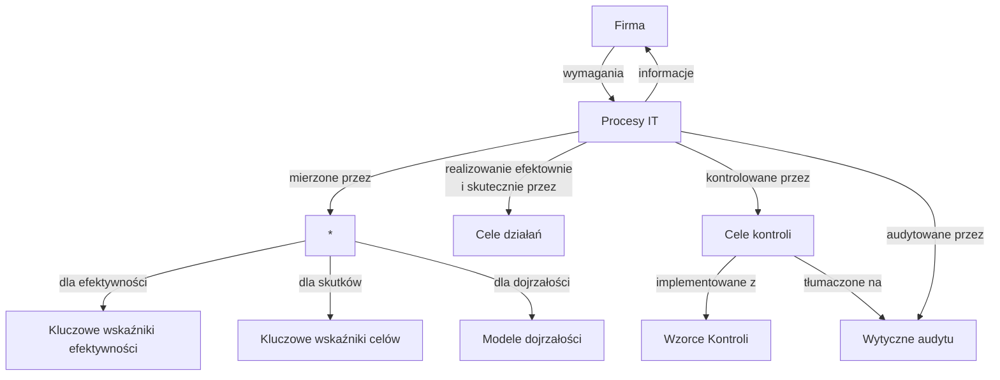

# Covid 4.0 (5G) aka pomiar efektywności
## CoBit jako model IT Governance
CobiT to połączenie COSO (zorientowane bardziej biznesowo) oraz ISO7799(zorientowane na bardziej IT)

Cobit jest to po prostunarzędzie zarządzania i ma funkcjonować wysokim poziomie (w porównaniu do innych standardów)

## Struktura IT Governance
- IT governance
  - Integracja strategiczna
  - Dostarczanie wartości
  - Zarządzanie ryzykiem
  - Zarządzanie zasobami
  - Pomiar efektywności

## Struktura i powiązania komponentów Cobit

## Jak CobiT służy menadzerom
- Kluczowe wskaźniki celów biznesu i IT
  - Integracja strategii IT z celami firmy
  - Stopniowe schodzenie strategii i celów do organizacji
  - Modyfikowanie struktur organizacyjnych wspierających implementację strategii
- Model CobiT
  - Adaptacja modelu kontroli i zarządzania (control and governance framework)
  - Implementacja infry IT, wspomagającej tworzeinie i alokację informacji zarządczej
- Procesy IT, KGI, KPI, potencjał IT, modele dojrzałości
  - Orientacja na ważnych procesach IT i kluczowych kompetencjach
  - pomiar efektywności
  - zrozumienie i niezbędnych usprawnień w potencale IT
  - Docenienie konsekwencji błędów i zaniechań
## Modele dojrzałości - podstawowe pojęcia
- jak konkurencji w branży zarzązdają IT (my a oni?)
- co możemy przyjąć z wzrocowych rozwiązań w branży i jak w nich wyglądamy (my a najlepsze wzorce)
- przy powyższych porównaniach czy zrobiliśmy wszystko co możliwe?
- Jak identyfikujemy to co jest wymagane do wykonania aby osiągnąć adekwatny poziom zarządzania i kontroli procesów IT?
## Modele dojrzałości - co nam dają
Kierownictwo może identyfikować
- rzeczywistą efektywność przedsiębiorstwa (ocena stanu obecnego)
- Obectny stan w branży (porównywalność)
- Cel doskonalenia przedsiębiorstwa (Dokąd zmierzamy?)
## Ogólna postać modeli dojrzałości (6)
0. procesy zarządzanie nie są stosowane
1. procesy są ad hoc i niezorganizowane
2. procesy przebiegają według regularnyh wzorców
3. procesy są dokumentowane i komunikowane
4. procesy są monitorowane i mierzone
5. dobre wzorce są rozwijane i automatyzowane
## Trzy wymiary modeli dojrzałości
1. Jak? Misja i cele IT
2. Co? Ryzyko i zgodność z wymogami.
3. Jak bardzo? ROI i efektywność kosztowa.

## Cele i mierniki CobiT
Na trzech poziomach
1. co firma oczekuje od IT?
2. co proces IT musi dostarczyć?
3. miary efektywności procesu? czy dobrze jest realizowany?
## Kluczowe wskaźniki celu - KGI
KGI (Key Goal Indicators) to miary wskazane przez kierownictwo, czy określony proces IT przebiegał według założonych wymagań pod względem kryteriów informacyjnych:
- dostępności infomracji niezbędnej do wspierania potrzeb firmy
- braku jej intergralności ryzyka poufności
- efektywności kosztownej procesów i działań operacyjnych
- potwierdzenia niezawodności skuteczności i odpowiedniości informacji
## Kluczowe wskaźniki efektywności - KPI
KPI (Key Performance Indicator) - to miara która określa jak dobrze określony proces IT jest realizowany względem możliwości osiągnięcia postawionego celu

są wskaźnikami prospektywnymi, wskazując prawdopodobieństwo osiągnięcia założonego celu

są dobrymi wskaźnikami do określenia potencjału, doświadczenia i umiejętności informatycznych firmy

mierzą cele procesu, które są tymi działaniami właściciela procesu które musi podjąć w celu osiągnięcia określonego poziomu efektywności procesu

# Wymagania wobec wskaźników
- wysoka skuteczność względem wysiłku na ich pozyskanie (high insight to effort ratio)
- wewnętrzna porównywalność
- zewnętrzna porównywalność
- lepiej kilka małych niż długą listę niskiej jakości
- łatwość pomiaru i czytelność

## Notes
Cele firmy i cobit --> informacja

Informacja --> Planowanie i organizacja --> Akwizycja i implementacja --> dostarczenie i serwis --> monitoring --> informacja --> ...

## Wnioski
- Cobit 4.0 zmierza wyraźnie w kierunku strategicznego zarządzania informacja (IT Governance)
- zarządzanie efektywnością informatyki powinno uwzględniać zachowania powiązań celów IT z celami Firmy
- cobid 4.0 wykorzystuje koncepcję BSC w budowie ITSC (IT ScoreBoard, informatyczna karta wyników)
- Model zarządzania cobit 4 korzysta z benchmarkingu
- cobit 4 zapewnia integrację na wielu poziomach zarządzania informatyką firmy (KPI na niższym poziomie to KGI wyższego)